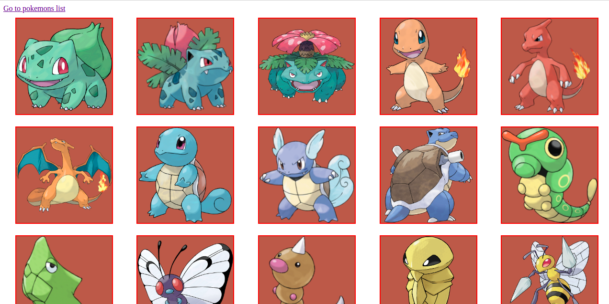

# List of 20 Pokemon cards

The App grabs a list of 20 pokemons from the server and prints them out

<a href="https://bullet03.github.io/pokemon/">DEMO<a>

- React v17 (CRA)
- Routing
- CSS modules

### To Run Locally

- clone the repo;
- use npm install/yarn to install all the dependencies
- use npm start/yarn start to run locally